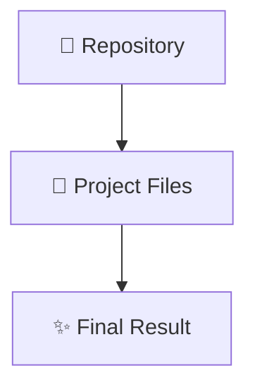

# 📁 ivanr-cv-bdm-040426 - Project

A generic code repository.

## 🚀 Overview

This repository contains the source code for **ivanr-cv-bdm-040426**. It serves as an example or functional implementation of its respective stack.

## 🛠 Technology Stack

- **Format**: Various files

## 🏗 Architecture / Workflow

## ⚙️ Usage

To run or view this project locally:
1. Clone the repository: `git clone https://github.com/iv150320/ivanr-cv-bdm-040426.git`
2. Open the project in your preferred environment.
3. For web apps, open the `index.html` file in a browser or serve it via a local web server (e.g. `npx serve` or Live Server).

---
**Author**: @iv150320
